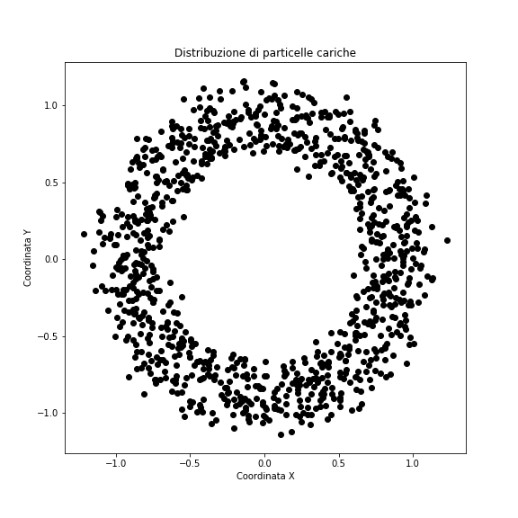

# Laboratorio di informatica (8/12)
### Prof. Stefano Carrazza - Corso C - 2020/21

**Riassunto:** Esercizi di base in C++: strutture dati e primi steps con ROOT.

Prima di iniziare suggeriamo di create una cartella per questa lezione in cui potete salvare tutti i files che saranno creati per gli esercizi.
```bash
cd ~/           # ci porta alla home directory
mkdir lezione8  # crea la directory sulla vostra home
cd lezione8     # entrate dentro la cartella
```
dopodiché creare un `makefile` con le istruzioni di compilazione per tutti gli esercizi.

## Esercizio 1 - Hello World struct

Scrivere un programma in C++ in cui dei numeri complessi vengono salvati in una struttura dati.

1. Creare una struttura dati chiamata `complex`. Dentro questa `struct` implementare
due membri di tipo `double` per la parte reale, `real`, e per la parte immaginaria `imag`.

2. Scrivere la funzione `main` e dichiarare 2 variabili di tipo `complex` chiamate `a` e `b` rispettivamente.

3. Assegnare ad `a` il numero complesso `7 + 2i`.

4. Assegnare a `b` il valore di `a`.

5. Implementare una funzione che prende un `complex` e stampa su terminale la parte reale e immaginaria come una copia di numeri tra parantesi tonde, separate da virgola.

6. Utilizzare la funzione precedente per stampare il contenuto di `a` e `b`.

7. Implementare una funzione `modulo` di tipo `double` che calcola il modulo di un `complex`. Testare tale funzione direttamente sul main passando `a` come argomento.

8. Implementare una funzione `somma` di tipo `complex` che prende come argomenti 2 oggetti `complex` e ritorna un nuovo oggetto `complex` in cui le parti reale e immaginaria corrispondono a quelle della somma degli argomenti.

## Esercizio 2 - Headers e sorgente

Scrivere un programma in C++ in cui viene utilizzato un file header.

1. Creare un file header intitolato `funzioni.h` e dichiarare una funzione `scambia1` di tipo `void` che prende come argomenti i riferimenti a 2 numeri di tipo `double`.

2. Sempre sullo stesso header, dichiarare un'ulteriore funzione chiamata `scambia2` di tipo `void` che prende i puntatori di 2 numeri di tipo `double`.

3. Creare un file `funzioni.cc` in cui viene implementato un algoritmo di scambio tra le variabili di tipo `double` per le funzioni `scambia1` e `scambia2`.

4. Creare un file `main.cc`, includere il header `funzioni.h` e testare le funzioni `scambia1` e `scambia2`.

5. Aggiustare sul `makefile` il commando di compilazione tenendo conto di tutti i files `*.cc`.

## Esercizio 3 - Hello world ROOT

Primi steps con ROOT in modalità iterativa.

*Comandi di base*

1. Aprire un terminale e lanciare ROOT con il commando `root`.

2. Provare ad eseguire codice C++ in modalità iterativa, provare:
  - `5+2`
  - `double a = 5, b=-2; cout << a + b << endl;`
  - provare altre istruzioni in C++.

3. Uscire da ROOT con il commando `.q`.

*Funzionalità grafiche*

1. Lanciare ROOT da terminale.

2. Proviamo a disegnare una funzione a una variabile con ROOT. Scrivere il codice seguente:
```c++
TF1 f("f", "sin(x)/x", -5, 5);
f.Draw();
```

3. Sulla finestra grafica visitare View -> Editor, provare a:
  - cambiare il colore della funzione disegnata.
  - aggiungere il titolo `x` sull'asse x.
  - salvare il plot su PDF.

4. Chiudere la finestra grafica e uscire da ROOT con il commando `.q`.

## Esercizio 4 - Macro ROOT 1

Scrivere una macro di ROOT in cui vengono generati e stampati su terminale dei numeri random tra [0,100].

1. Creare un file macro ROOT chiamato `esercizio4.C`.

2. Implementare un ciclo da `1000` chiamate alla funzione `rand() % 100` per generare numeri casuali interi tra [0,100]. Salvare tutti i numeri casuali in un array.

3. Calcolare il valore medio dell'array.

4. Provare ad eseguire la macro con:
  - `root esercizio4.C`
  - `root` seguito da `.x esercizio4.C`.


## Esercizio 5 - Macro ROOT 2

Scrivere una macro di ROOT con funzioni.

1. Creare un file macro ROOT chiamato `esercizio5.C`.

2. Implementare il codice dell'esercizio 1 dentro questa macro, sostituendo la funzione `int main()` con `void esercizio5()` e aggiornando il suo `return`. Modificare anche il nome della `struct complex` in `struct mycomplex` per evitare conflitti con la classe `std::complex` caricata in automatico da ROOT6.

3. Eseguire la macro con:
  - `root esercizio5.C`
  - `root` seguito da `.x esercizio5.C`
  - `root` seguito da `.L esercizio5.C` e infine la chiamata a `esercizio5()`

4. Controllare che in tutti i casi il risultato è lo stesso dell'esercizio 1.

## Esercizio 6 - Macro ROOT 3

Scrivere una macro di ROOT con array di `struct`. Leggere da file le coordinate cartesiane di particelle cariche sotto un campo magnetico con sorgente centrata in `(0,0)` secondo la figura seguente:


1. Creare un file macro ROOT chiamato `esercizio6.C`.

2. Definire una `struct point2d` in cui vengono salvati un puntatore `coordinate` e una variabile `distance` di tipo `double`.

3. Scaricare il file che contiene le coordinate `(x,y)` per ogni particella con `wget`:
```
wget https://raw.githubusercontent.com/scarrazza/informatica2020/master/Lezione_8/data.dat
# oppure
curl https://raw.githubusercontent.com/scarrazza/informatica2020/master/Lezione_8/data.dat -o data.dat
```

4. Creare una funzione `esercizio6` di tipo `void` e creare un array di strutture `point2d` chiamato `punti` di dimensione 1000, implementare un ciclo in cui ogni per ogni elemento `point2d` il puntatore `coordinate` viene inizializzato come un array dinamico di dimensione 2, in cui il primo valore corrisponde alla `x` e il secondo all'`y` letti da file.

5. Scrivere una funzione `compute_distance` di tipo `void` che prende come argomento 1 `point2d` e calcola la distanza rispetto alla sorgente usando il teorema di Pitagora.

6. Calcolare la `distanza` media per tutti gli elementi dell'array `punti` tramite una funzione `mean` di tipo `double` che prende come argomento l'array `punti` e la sua dimensione.

7. Pulire la memoria su heap ed eseguire la macro con ROOT.
